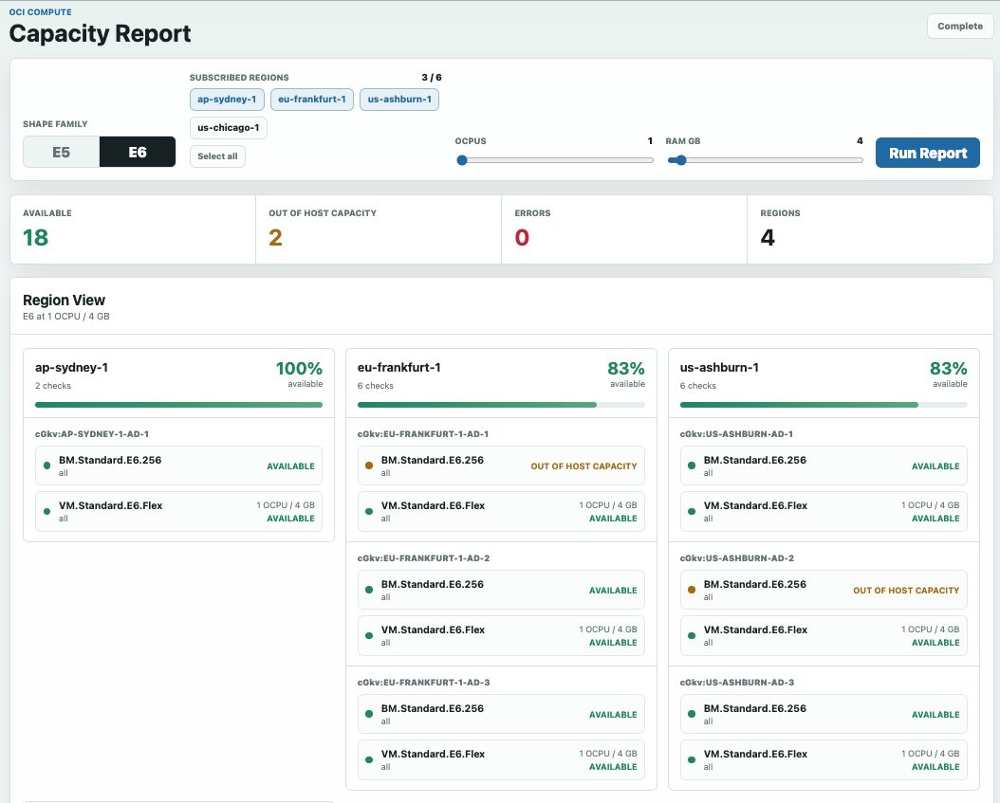

# OCI Capacity Dashboard

A local single-page dashboard for running OCI Compute capacity reports across the OCI regions your tenancy is subscribed to.



The app uses:

- A small Node.js server for the web UI and API endpoints.
- The official OCI TypeScript/JavaScript SDK for authentication and OCI API calls.

## Prerequisites

- Node.js 18 or newer.
- A valid OCI CLI config file at `~/.oci/config`.
- A `DEFAULT` profile in `~/.oci/config` with at least:
  - `tenancy`
  - `user`
  - `fingerprint`
  - `key_file`
  - `region`
- IAM permissions to list region subscriptions, list availability domains, list compute shapes, and create compute capacity reports.

## Run The Dashboard

From this project directory:

```bash
npm start
```

Then open:

```text
http://127.0.0.1:3000
```

If port `3000` is already in use:

```bash
npm run start:3001
```

Then open:

```text
http://127.0.0.1:3001
```

## Dashboard Usage

1. Select `E5` or `E6`.
2. Select one or more subscribed regions.
3. Adjust OCPUs.
4. RAM defaults to `4 GB` per OCPU and can be adjusted manually.
5. Click `Run Report`.

The dashboard streams progress while the report runs, including the region currently being checked.

## Development Checks

```bash
npm test
```

The automated tests use a mocked OCI SDK client and do not call your tenancy.

An optional live parity check compares this branch against the Python implementation from `master` using your real OCI config:

```bash
npm run parity:live -- --families E5 --regions us-ashburn-1 --ocpus 1 --memory-gbs 16
```

## Notes

- The dashboard only shows regions your tenancy is subscribed to.
- OCI may return errors if a shape is not available in a selected region or availability domain.
- Flex shape checks include an `instanceShapeConfig`; bare metal shapes do not.
- E5 and E6 slider limits are capped to current OCI standard flex VM limits used by the app.

## Troubleshooting

If `npm start` fails with `EADDRINUSE`, another process is using port `3000`.

Find it:

```bash
lsof -nP -iTCP:3000 -sTCP:LISTEN
```

Stop it:

```bash
kill <PID>
```

Or run this app on port `3001`:

```bash
npm run start:3001
```
